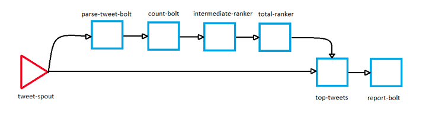
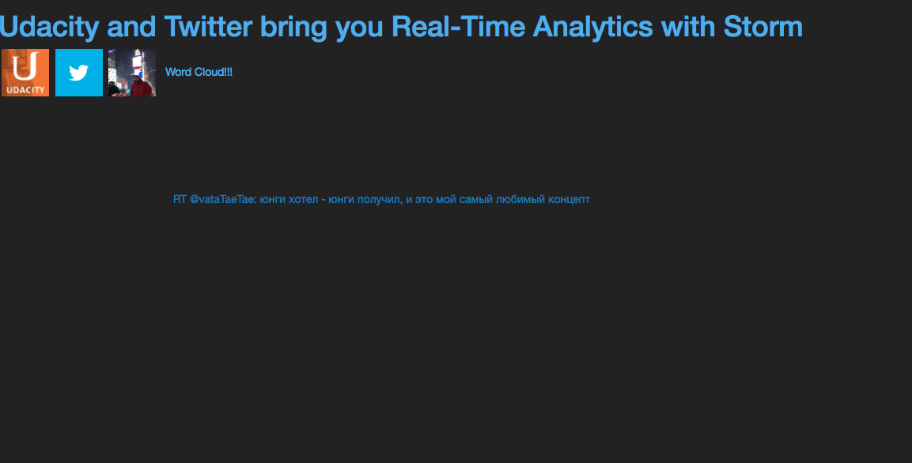

# RealTimeAnalyticsSystem

Dynamic visualization of tweets is quite trending now a days.
This project mainly focuses on dynamic visualization of the tweets which contain world wide topN hash tags. N can be any number eg : 1,10,20 etc.

## Goal

Real-time dynamic visualization of tweets that contain worldwide top hashtags.

## Design:

Started with a storm topology that calculates TopN Hashtags and then wrote new Bolt that takes TopN Hash tags with a streaming join of real-time tweets. Finally visualized only tweets that contain the TopN Hashtags.

## Technology stack

<table>
<thead>
<tr>
<th>Area</th>
<th>Technology</th>
</tr>
</thead>
<tbody>
    <tr>
        <td>Front-End</td>
        <td> HTML, CSS, D3.js , Java script </td>
    </tr>
    <tr>
        <td>Back-End</td>
        <td>Flask (Python) </td>
    </tr>
  <tr>
        <td>Distributed Real Time Computation System</td>
        <td>Apache Storm (Java)</td>
    </tr>
    <tr>
        <td>In-Memory Caching / Datastore</td>
        <td>Redis</td>
    </tr>
    <tr>
        <td>Other APIs Used</td>
        <td>Twitter streaming using Twitter 4j api</td>
    </tr>
</tbody>
</table>
 

## Storm Topology Used:

ParseTweetBolt: receives every tweet emitted by the TweetSpout, parses them to find hashtags and emits each of them (if any).

Count HashtagBolt: has an HashMap for counting every hashtag (the key is the hashtag and the value is the number of times it appeared in a tweet); it receives an hashtag from the preceding bolt and updates the map consequently.

IntermediateRankginsBolt: the one used in the course with no modifications.

TotalRankingsBolt (total-ranker): the one used in the course with no modifications.

TweetsWithTopHashtagsBolt (top-tweets): this bolt receives data both from the TweetSpout and the TotalRankingsBolt; if the data come from the TotalRankingBolt, it updates an internal Rankings object with the one received, so that it has always the updated hashtags rankings. If the data come from the TweetSpout, it checks if the tweet contains one or more hashtags and if at least one of them is contained in the rankings object: if true emits the tweet to the ReportBolt, otherwise it will be discarded. The tweet is emitted to the next bolt along with the size of the font to display it: the higher rank the hashtag has, the bigger the font will be (this value is normalized against the max rank to avoid too big fonts).

ReportBolt: this Bolt publishes the data to the Redis instance.

## Instructions for Project Execution :

Install Vagrant (See the below link)

https://www.vagrantup.com/docs/installation/ 

Install VirtualBox (See the below link)

https://www.virtualbox.org/manual/ch01.html

Create a twitter app (See the below link)

http://docs.inboundnow.com/guide/create-twitter-application/

Open the TopNTweetTopology file which is located in the below path 

AnalyticsSystem - src - jvm - udacity - storm  

locate the below code in the source code

   // now create the tweet spout with the credentials
    TweetSpout tweetSpout = new TweetSpout(
        "",
        "",
        "",
        ""
    );

Then enter below mentioned in the string literals (follow the order)

Customer Key

Secret Key

Access Token

Access Secret

Then Navigate to the project root directory through terminal

Execute below commands:
   
    vagrant up   

    vagrant ssh

    cd /vagrant/AnalyticsSystem

    mvn package

    storm jar target/udacity-storm-lesson3_stage5-0.0.1-SNAPSHOT-jar-with-dependencies.jar udacity.storm.TopNTweetTopology

    open another terminal

    Then Navigate to the project root directory through terminal

    Execute below commands:
   
    vagrant up   

    vagrant ssh

    cd /vagrant/viz

    python app.py  --- launches the visualization. Built by using Flask python based micro frame work

    Now navigate to the browser and enter url as http://localhost:5000

## Visualization output:

 

## Future Scope:

   Display more number of tweets in the visualization rather than single dynamic tweet which contains TopN hash tags
